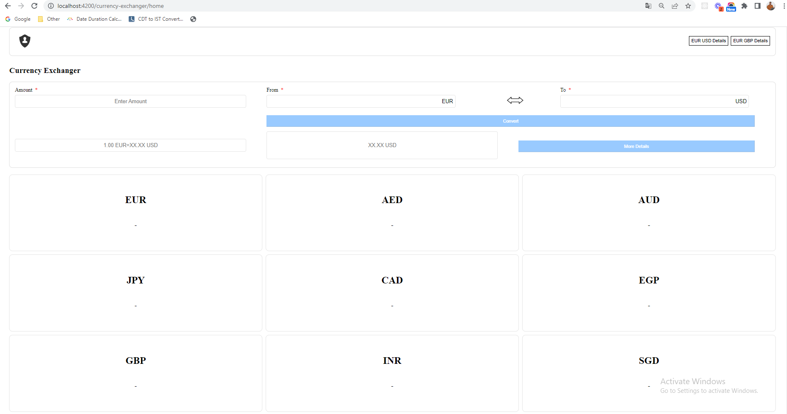
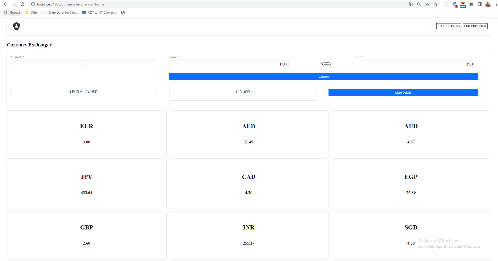
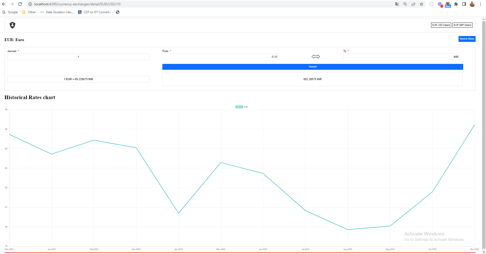

# Currency Converter App

## Description

- Convert currency using amount, from and to country codes
- Display historical chart data with part year change of currency
- Display converted currency value for 9 popular countries

## Run App locally

- Run `npm i` to install required node module dependencies
- Add `API_KEY` key inside `environment.ts` file here : `/src/environments/environment.ts`
- Run `ng serve` for a dev server. Navigate to `http://localhost:4200/`. The app will automatically reload if you change any of the source files.

## Running unit tests

Run `ng test` to execute the unit tests.

## Screenshorts

`1. Home screen before converting - Default`

`2. Home screen after converting currency`

`3. Detail screen after converting currency`

